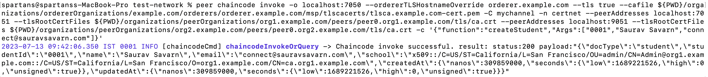
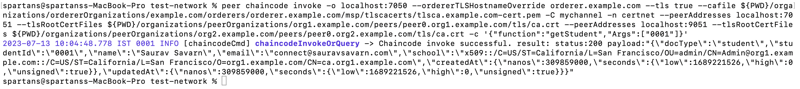

<b>Distributed Certification Network</b>  
*   A hyperledger fabric network to demonstrate certificate creation, exchange and verification between education providers.  
*   Fabric Network is composed of below underlying structures

        --  3 Organizations (MIT, UpGrad, Government) with TLS Enabled
        --  2 Peers per org
        --  Raft Ordering with single node

*   Problem Statement  
     We will look at the problem statement that we will be using to build a decentralized application over Hyperledger Fabric.
     This application is a certification-network, where the participants are the college/school (giving certificates), employer (validating certificates released by the institution) and the government body (who is acting as a controller body responsible for auditiing and making the educational policies of the country)

*   Steps to start a test-network for running/testing of chaincodes written locally over dev environment  

    Step-1: switch inside the test-network directory
            $> cd test-network

    Step-2: Hook up the test network using below commands -
            $> ./network.sh up

            NOTE: the above command will bootstrap a basic fabric-network up and running to run & test the chaincodes.
                  this single command will do following things -
                  a. create all crypto materials required
                  b. create the channel artifacts
                  c. start the docker compose network or the various docker containers, which can be verified from the docker-desktop
                     or docker terminal using commands "docker ps -a"

                     NOTE: we can see that the docker containers that spawns up has 2 peers (each one of them from 2 different organizations), 1 orderer and 1 cli containers.  

    Step-3: Create Channel
            $> ./network.sh createChannel

            NOTE: the above command will create a channel called "mychannel", which is the default name set for this channel, and it
                  will make all the peers available in the network, join this channel. It will also update the channel configuration
                  to define both of the peers as anchor peers, one peer each for the organization inside of this channel. 

    
    NOTE: with these step of commands as mentioned in from Step-1 to Step-3, we have successfully setup a fully functional fabric
          network inside of the dev machine (or machine where we run the above commands), in matter of few seconds.

*   Steps to deploy the chaincode over the test-network spawned above  
    To deploy the chaincode, we have to use another function inside network.sh script, which is inside of the test-network directory 
    called "deployCC".

    $> ./network.sh deployCC -ccn <name_of_chaincode_trying_to_deploy> -ccl <language_of_chaincode_trying_to_deploy> -ccp <path_where_
        this_chaincode_directory_is_available_so_that_the_scripts_can_take_it_package_it_and_then_approve_and_eventually_compile_and_
        deploy_this_on_top_of_the_network> -ccv <chaincode_version> -ccs <chaincode_package_sequence_number_that_is_being_installed_and_committed_on_all_of_the_peers_inside_of_this_network> -cci <chaincode_default_invoke_method>
        
        NOTE: -ccn <name_of_chaincode_trying_to_deploy> : this could be name of the chaincode, we can assign any name to it.

    e.g.
    $> ./network.sh deployCC -ccn demo -ccl javascript -ccp ../chaincode -ccv 1 -ccs 1 -cci instantiate     

    NOTE: This script takes in a few input parameters -
        1. chaincode name
        2. language for the chaincode
        3. path to your chaincode
        4. version number of the chaincode
        5. sequence number of the chaincode package that is being installed or committed on all of
           the peers inside of this network
        6. and a function definition that you want to invoke as part of the deployment instantiation
           process

*   Addition of start scripts in chaincode's package.json  

    "scripts": {
        "test": "nyc mocha test --recursive",
        "start": "fabric-chaincode-node start" 
    },    

    NOTE: what the script, "fabric-chaincode-node start", make sure is this particular SDK which is the fabric's node SDK for the
          chaincode container would be started the moment that particular container boots up.

*   Required dependencies and dev-dependencies are required for the chaincode development and testing  

    $> npm install --save fabric-contract-api
    $> npm install --save fabric-shim

    NOTE: above is going to install dependencies required for the chaincode development

    $> npm install --save-dev chai
    $> npm install --save-dev chai-as-promised
    $> npm install --save-dev eslint
    $> npm install --save-dev mocha
    $> npm install --save-dev nyc
    $> npm install --save-dev sinon
    $> npm install --save-dev sinon-chai

    NOTE: above is going to install dev-dependencies

*   Invoke Chaincode Functions  
    Follow below steps to invoke chaincode functions -

    1.  ####Update the path to where the binaries are available inside of your computer by typing the below command
        $> export PATH=${PWD}/../bin:$PATH
    
    2.  ####Define the Fabric config path by typing the following command:
        $> export FABRIC_CFG_PATH=$PWD/../config/
    
    2.  ####Export certain environment variables that will be used further as part of your invoke command as shown below:
    $> export CORE_PEER_TLS_ENABLED=true
    $> export CORE_PEER_LOCALMSPID="Org1MSP"
    $> export CORE_PEER_TLS_ROOTCERT_FILE=${PWD}/organizations/peerOrganizations/org1.example.com/peers/peer0.org1.example.com/tls/ca.crt
    $> export CORE_PEER_MSPCONFIGPATH=${PWD}/organizations/peerOrganizations/org1.example.com/users/Admin@org1.example.com/msp
    $> export CORE_PEER_ADDRESS=localhost:7051

    *_> Invoke peer chaincode command/function to create student using function defined in chaincode 'createStudent'

    peer chaincode invoke -o localhost:7050 --ordererTLSHostnameOverride orderer.example.com --tls true --cafile ${PWD}/organizations/ordererOrganizations/example.com/orderers/orderer.example.com/msp/tlscacerts/tlsca.example.com-cert.pem -C mychannel -n certnet --peerAddresses localhost:7051 --tlsRootCertFiles ${PWD}/organizations/peerOrganizations/org1.example.com/peers/peer0.org1.example.com/tls/ca.crt --peerAddresses localhost:9051 --tlsRootCertFiles ${PWD}/organizations/peerOrganizations/org2.example.com/peers/peer0.org2.example.com/tls/ca.crt -c '{"function":"createStudent","Args":["0001","Saurav Savarn","sauravsavarn@gmail.com"]}'

    NOTE: 
        1.  -C : signifies the name of the channel on which we trying to access a particular chaincode
        2.  -n : signifies the name of the chaincode that you are trying to Invoke. Here we have deploying our chaincode on the channel
                 using the name 'certnet', we need to use the same name when we are trying to access the functions of that chaincode.
        3. --peerAddresses : signifies the IP-Addresses or the address and port number.
        4. --tlsRootCertFiles : signifies the tlsCertFiles for the peers that needs to provide endorsement responses to this particular  
                 invoke command.           

    [[OUTPUT]] :  After you press enter, this is what you can see on your screen:
        

    *_> Invoke chaincode function to fetch/get student using function defined in chaincode 'getStudent'

    peer chaincode invoke -o localhost:7050 --ordererTLSHostnameOverride orderer.example.com --tls true --cafile ${PWD}/organizations/ordererOrganizations/example.com/orderers/orderer.example.com/msp/tlscacerts/tlsca.example.com-cert.pem -C mychannel -n certnet --peerAddresses localhost:7051 --tlsRootCertFiles ${PWD}/organizations/peerOrganizations/org1.example.com/peers/peer0.org1.example.com/tls/ca.crt --peerAddresses localhost:9051 --tlsRootCertFiles ${PWD}/organizations/peerOrganizations/org2.example.com/peers/peer0.org2.example.com/tls/ca.crt -c '{"function":"getStudent","Args":["0001"]}'

    [[OUTPUT]] :  After you press enter, this is what you can see on your screen:
        